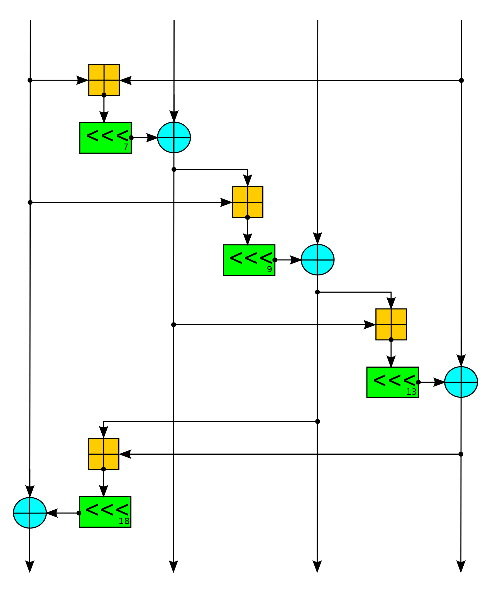

# Kotlin/Multiplatform Crypto: Salsa20 Stream Cipher

Pure Kotlin implementation of the [Salsa20 Stream Cipher][1].

## About

[Salsa20][1] is a [stream cipher][2] which is designed to support
high-performance software implementations.

This module also contains an implementation of [XSalsa20][3]: a variant
of Salsa20 with an extended 192-bit (24-byte) nonce.

> [!CAUTION]
> This crate does not ensure ciphertexts are authentic (i.e. by using a MAC to
> verify ciphertext integrity), which can lead to serious vulnerabilities
> if used incorrectly!

[1]: https://en.wikipedia.org/wiki/Salsa20

[2]: https://en.wikipedia.org/wiki/Stream_cipher

[3]: https://cr.yp.to/snuffle/xsalsa-20081128.pdf
